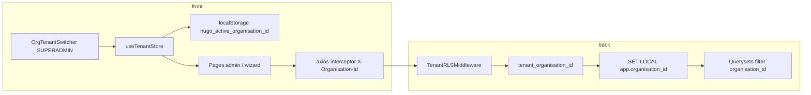

# Audit — organisation active (front admin/superadmin/tester)

**Date :** 26 juin 2026  
**Baseline :** front `localhost:5173` (mode `tester`), API `/api` → `127.0.0.1:8000`, compte `demo.superadmin`, org **Demo Hugo Org** (`dc1e8465-0ff2-4d66-bfbb-a0f8e7a23b3d`)  
**Preuves :** [`audit-organisation-active-2026-06-26/screenshots/`](audit-organisation-active-2026-06-26/screenshots/) + `journal.json`  
**Script :** `hugo-hugolucia/frontend_1.8/scripts/audit_organisation_active.mjs`

---

## Sources mobilisées

- Backend : `app_core/tenant_context.py`, `app_core/middleware.py`, `apps/referentials/views_groups.py`, `apps/accounts/views_admin.py`, `apps/referentials/views.py`
- Front : `stores/tenant.js`, `api/client.js`, `OrgTenantSwitcher.vue`, `TesterLayout.vue`, vues admin + wizard
- Runtime : captures Playwright + smoke API avec header `X-Organisation-Id`

---

## 1. Cartographie actuelle

### 1.a Backend / API — multi-tenant

| Mécanisme | Réel confirmé |
|-----------|----------------|
| `organisation_id` sur les modèles métier | Oui — groupes, users, memberships, référentiels, etc. |
| `TenantRLSMiddleware` | Oui — après auth, bind tenant + `SET LOCAL app.organisation_id` |
| Header `X-Organisation-Id` | Oui — lu par `resolve_effective_organisation_id()` |
| SUPERADMIN | Peut opérer dans une autre org **si** header valide et org existante |
| ORGADMIN / autres rôles | **Toujours** scopés à l’org « maison » du user ; header **ignoré** |

Filtrage effectif sur les endpoints admin utilisés :

| Endpoint | Filtrage observé (code) | Smoke runtime (Demo Hugo Org) |
|----------|-------------------------|-------------------------------|
| `GET /groups/` | `Group.objects.filter(organisation_id=org_id)` | 200 — 3 groupes (`_ux_audit_tmp_group2`, `bac pro melec`, `Demo Group`) |
| `GET /users/` | `User.objects.filter(organisation_id=org_id)` | 200 — 12 comptes |
| `GET /groups/{id}/members/` | `GroupMembership` filtré `organisation_id` + `group_id` | 200 — 7 membres |
| `GET /groups/{id}/referential-config/` | `get_object_or_404(Group, …, organisation_id=tenant)` | 200 — config présente |

**Conclusion backend :** les listes admin sont **org-scoped** via `tenant_organisation_id(request)`, lui-même alimenté par JWT + header pour le superadmin.

---

### 1.b Front — stockage, transmission, UI

#### Où l’orga active est stockée

| Couche | Détail |
|--------|--------|
| **Pinia `useTenantStore`** | `activeOrganisationId` + `activeOrganisationName` |
| **Persistance** | `localStorage` clé `hugo_active_organisation_id` (ID uniquement) |
| **Init login** | `auth.fetchMe()` → `tenant.syncFromUser(user)` |
| **SUPERADMIN** | Si ID déjà en localStorage → **conservé** ; sinon org du compte |
| **ORGADMIN** | ID + nom **forcés** depuis le user (pas de switch) |

#### Transmission API

```96:105:hugo-hugolucia/frontend_1.8/src/api/client.js
api.interceptors.request.use((config) => {
  // ...
  const tenantOrgId = localStorage.getItem(TENANT_STORAGE_KEY)
  if (tenantOrgId) {
    config.headers['X-Organisation-Id'] = tenantOrgId
  }
  return config
})
```

Tous les appels axios admin (groups, users, wizard, etc.) envoient l’ID stocké.

#### Sélection UI (changement d’orga)

**Composant :** `OrgTenantSwitcher.vue` — **visible uniquement pour SUPERADMIN**, dans la navbar `TesterLayout`.

- `GET /admin/organisations/` → liste des orgs
- `<select id="tenant-switcher">` — label « Organisation active »
- Au changement : `tenant.setActiveOrganisation(org)` puis **`window.location.reload()`** (rechargement complet)

**ORGADMIN :** pas de switcher ; org implicite = org du compte.

#### Indicateurs UI « vous êtes dans telle organisation »

| Emplacement | Contenu |
|-------------|---------|
| Navbar — switcher (SUPERADMIN) | Dropdown « Organisation active : Demo Hugo Org » |
| Navbar — menu user | `demo.superadmin — Demo Hugo Org` + badge SUPERADMIN |
| Corps de page | **Variable selon la vue** (voir §2) |

---

## 2. Visibilité UI en runtime (`demo.superadmin`)

| Page | Org dans le **corps** | Org dans la **navbar** | Bandeau / texte exact |
|------|----------------------|------------------------|------------------------|
| `/dashboard` | **Non** | Oui (switcher + dropdown user) | Aucun bandeau org dans le contenu |
| `/users` | **Oui** | Oui | « Organisation active : **Demo Hugo Org** » (sous le titre) |
| `/groups-admin` | **Oui** | Oui | « Organisation actuelle : **Demo Hugo Org** » |
| `/groups-admin/:id` | **Oui** | Oui | « Organisation : **Demo Hugo Org** » |
| `/admin/onboarding` | **Oui** | Oui | « Organisation active : **Demo Hugo Org** » + « Groupe de référence : bac pro melec » |

**Captures :** `01-dashboard.png` … `05-onboarding.png` dans le dossier screenshots.

### Capacités admin observées

| Question | Réponse runtime |
|----------|-----------------|
| Voir clairement l’organisation ? | **Oui** en navbar (superadmin) ; **partiel** dans le corps (dashboard sans bandeau) |
| Changer d’organisation ? | **Oui** — dropdown `#tenant-switcher` (superadmin uniquement) → reload page |
| Orga implicite session seule ? | ID persisté localStorage ; nom resynchronisé au mount du switcher ou via `syncFromUser` |

**Incohérence UX :** libellés différents — « Organisation active » / « Organisation actuelle » / « Organisation : » selon les pages.

---

## 3. Relation orga → wizard (`/admin/onboarding`)

| Aspect | Comportement réel |
|--------|-------------------|
| Liste de groupes | `GET /groups/` — **filtrée par org active** (header + RLS) |
| Affichage orga | `activeOrganisationLabel` depuis `useTenantStore` / fallback `auth.user.organisation_name` |
| Affichage groupe | « Groupe de référence : &lt;nom&gt; » — **pas** l’ID org |
| Store « org courante » | `useTenantStore` partagé avec le layout ; **pas** de store groupe global |
| Multi-orga dans le wizard | **Non** — pas de sélecteur d’org ; rechargement si switch navbar (`watch tenant.activeOrganisationId`) |
| Scope | **Org-scoped** (une org à la fois, celle du tenant store) |

Le wizard **ne choisit pas** l’organisation : il **hérite** du contexte déjà fixé par login + switcher navbar.

---

## 4. Risques / limites

| Risque | Niveau | Constats |
|--------|--------|----------|
| Dashboard sans bandeau org dans le contenu | **Moyen** | Org visible navbar seulement ; section admin + testeur sans rappel org |
| Incohérence des libellés org entre pages | **Faible** | active / actuelle / « Organisation : » |
| Superadmin multi-org : oubli de l’org active après reload | **Moyen** | Switcher présent mais pas rappelé dans le wizard sur le lien org→groupes |
| `activeOrganisationName` vide transitoirement | **Faible** | Nom pas en localStorage ; dépend du switcher ou `syncFromUser` |
| Wizard évalue un seul groupe sans rappel explicite « groupes de cette org » | **Moyen** | Affiche org + groupe référence, mais pas la phrase de scope |
| ORGADMIN : pas de risque multi-org | **N/A** | Org fixe — comportement correct |
| Cross-tenant via header forgé (non-superadmin) | **Faible** (sécurité backend OK) | Header ignoré hors SUPERADMIN |

**Aucun risque critique** identifié sur le filtrage API en conditions testées.

---

## 5. Propositions d’ajustement (minimalistes)

### Proposition 1 — Bandeau org sur `/dashboard` (recommandé)

Ajouter le même pattern que `/groups-admin` :

> Organisation actuelle : **Demo Hugo Org**

Effort faible, aligne le point d’entrée admin avec les autres pages.

### Proposition 2 — Encart scope dans `/admin/onboarding`

Sous l’en-tête existant, une phrase explicite :

> Ce parcours concerne l’organisation **Demo Hugo Org**. Les groupes et statuts affichés sont ceux de cette organisation.

Pas de sélecteur d’org dans le wizard — le switcher navbar reste la source de vérité.

### Proposition 3 — Harmoniser le libellé bandeau (optionnel)

Convention unique sur toutes les pages admin : **« Organisation active : … »** (`UsersView`, `GroupsAdminListView`, `GroupAdminDetailView`, dashboard).

### Proposition 4 — Contexte org au niveau layout (lot ultérieur)

Une fine barre sous la navbar dans `TesterLayout` (toutes pages tester admin) :

`Organisation active : Demo Hugo Org` (+ lien « Changer » vers switcher pour superadmin).

Évite de dupliquer les bandeaux page par page ; **plus large** que les 3 ajustements ci-dessus.

### Ce qu’on ne propose **pas** maintenant

- Sélecteur d’org **dans** le wizard (redondant avec `OrgTenantSwitcher`)
- Store global « groupe courant » (hors scope org)

---

## 6. Synthèse décisionnelle

| Question | Réponse |
|----------|---------|
| Le wizard est-il org-scoped ? | **Oui** — via header API et tenant store |
| Le wizard est-il multi-orga ? | **Non** — une org à la fois, changement via navbar superadmin uniquement |
| Suffit-il d’améliorer la visibilité ? | **Oui pour un premier lot** — dashboard + encart wizard + harmonisation libellés |
| Faut-il un sélecteur layout admin ? | **Déjà présent** pour superadmin (`OrgTenantSwitcher`) ; améliorer la **visibilité** plutôt qu’ajouter un second sélecteur |

**Recommandation :** lot **visibilité** (propositions 1–2, éventuellement 3) sans nouveau sélecteur. Réserver la barre layout globale (proposition 4) si la duplication des bandeaux devient pénible.

> **Mise à jour 26/06/2026 — lot livré :** bandeau harmonisé `ActiveOrganisationBanner` sur dashboard, users, groups-admin, wizard ; wizard généralisé avec sélecteur de groupe. Voir [`WIZARD_ORG_GROUP_UPDATE_2026-06-26.md`](WIZARD_ORG_GROUP_UPDATE_2026-06-26.md).

---

## 7. Annexe — chaîne technique (schéma)



---

## 8. Fichiers de preuve

| Fichier | Contenu |
|---------|---------|
| `screenshots/01-dashboard.png` | Pas de bandeau org corps ; switcher visible |
| `screenshots/02-users.png` | Org dans le corps |
| `screenshots/03-groups-admin.png` | Bandeau « Organisation actuelle » |
| `screenshots/04-group-detail.png` | Bandeau « Organisation : » |
| `screenshots/05-onboarding.png` | Org + groupe de référence |
| `screenshots/journal.json` | Métadonnées automatisées + counts API |
