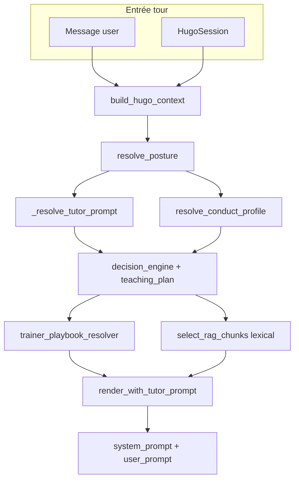

# Audit Pass 1 — Orchestrateur conversationnel tuteur / formateur

**Date :** 2026-07-01  
**Baseline :** B (front `frontend_1.8` + `hugo_back` local, `config.settings.sqlite_test`)  
**Pipeline actif par défaut :** P0 legacy (`HUGO_P0_V17_ENABLED=false`)  
**Statut :** Pass 1 terminé — gate vers Pass 2 conditionné (voir §7)

---

## 1. Sources mobilisées

### Docs
- `docs-workspace/recalage_actualisation_2026_07_01/R0_README_ACTUALISATION_ET_MODE_D_EMPLOI.md`
- `R1_ETAT_REEL_ACTUALISE.md`, `R3_ARCHITECTURE_ET_PIPELINES_ACTUALISES.md`, `R4_CONTRATS_ET_PREUVES_RUNTIME.md`
- `R6_PREUVES_MANQUANTES_ET_PLAN_DE_RECALAGE.md`
- `docs-workspace/variables_prompting.md`, `inventaire_variables_templates_prompt_hugo.md`
- `docs-workspace/addendum_front_chats_lots_ABC_2026_07_01.md`, `P1_plan_chat_tuteur.md`

### Backend
- `apps/hugo/models.py`
- Migrations : `0003_tutorprompt_*`, `0018_evaluation_and_conduct_profiles`, `0020_learner_conversation_global_profile`
- `services/hugo_orchestrator.py`, `context_builder.py`, `prompt_renderer.py`, `conduct_profile_resolver.py`, `learner_profile_resolver.py`, `trainer_playbook_resolver.py`, `tutor_workspace_bootstrap.py`, `session_profile_create.py`
- `views_tutor_prompts.py`, `views_conduct_profiles.py`, `views_learner_conversation_profiles.py`, `views_evaluation_config.py`, `urls.py`, `serializers.py`

### Front (baseline B)
- `src/router/index.js`, `src/constants/adminConversationModes.js`
- `src/views/admin/AdminConversationIndexView.vue`, `LearnerConversationProfilesView.vue`, `LearnerModeHubView.vue`, `TutorOrchestratorAdminView.vue`, `TrainerOrchestratorAdminView.vue`
- `src/views/TutorPromptsView.vue`, `ConductProfilesView.vue`
- `src/components/admin/conversation/*`

### Tests / preuves exécutées (Pass 1)
- Script audit Django local (résolution + rendu par type de session)
- `pytest` ciblé : `test_prompt_renderer.py`, `test_learner_conversation_global_profile.py`, `test_chats_reconf_morning_baseline_b` (sous-ensemble) — **17/17 PASS**
- Références : `test_cluster3_oracles.py`, `test_cluster16_interface_apprenant_backend.py` (lecture — hors exécution complète Pass 1)

---

## 2. Réel confirmé

### AUDIT-01 — Modèles backend / DB

| Modèle | Table | Rôle observé | Champs structurants | Tag |
|--------|-------|--------------|---------------------|-----|
| **TutorPrompt** | `tutor_prompt` | Template conversationnel `system_template` + `user_template` | `organisation`, `code`, `prompt_type` (= `AFEST_HUGO` seul), `conversation_profile`, `is_default`, `is_active`, paramètres LLM | **REL OBSERV** B |
| **TutorConductProfile** | `tutor_conduct_profile` | Règles posture (gestes, max questions) | `organisation` nullable, `posture`, templates conduct, `unique_together (org, posture)` | **REL OBSERV** B |
| **LearnerConversationGlobalProfile** | `learner_conversation_global_profile` | Agrégateur 3 prompts + 3 conduct + eval | FK slots diagnostic / réflexif / bûchage + `evaluation_*` | **REL OBSERV** B |
| **EvaluationPromptProfile** | `evaluation_prompt_profile` | 3 textes évaluation (`frame`, `judgement`, `output`) | Hors tuteur/formateur chat | **REL OBSERV** B |
| **TrainerConversationProfile** (ou équivalent) | — | **Absent** | — | **REL OBSERV** (négatif) B |
| **TutorOrchestratorProfile** dédié | — | **Absent** | P1 tuteur détourne `LearnerConversationGlobalProfile` nommé `tutor_workspace_*` | **REL OBSERV PARTIEL** B |

**Affectation session** (`HugoSession`) — **REL OBSERV** B :
- `learner_conversation_profile` → résolution via `session` > `group.default_learner_conversation_profile` > org `is_default`
- `tutor_prompt` (legacy, déprécié si profil global présent)
- `session.learner` = user propriétaire du fil (y compris TUTOR / TRAINER sur leurs chats P1)

**Bootstrap P1 tuteur** (`ensure_tutor_workspace_profiles`) — **REL OBSERV** B :
- Crée 4× `TutorPrompt` (`tutor_workspace_*`) + 4× `LearnerConversationGlobalProfile` + `TutorConductProfile` par posture
- 1 prompt primaire par profil (slot unique selon posture)

**Séparation org / groupe / persona**
- Org : tous les modèles ci-dessus sont scopés `organisation_id` (+ tenant header)
- Groupe : `Group.default_learner_conversation_profile` (migration `referentials/0018`)
- Persona : **pas de champ `persona`** ; distinction implicite par `name` profil (`tutor_workspace_*`) ou rôle user session

---

### AUDIT-02 — API réelles

| Endpoint | Méthodes | ACL | Serializer / notes | Tag |
|----------|----------|-----|-------------------|-----|
| `/hugo/tutor-prompts/` | GET auth ; POST orgadmin+ | Tenant org | `TutorPromptSerializer` — inclut `system_template`, `user_template` | **REL OBSERV** B |
| `/hugo/tutor-prompts/{uuid}/` | GET auth ; PATCH/DELETE orgadmin+ | idem | Test PATCH superadmin OK (`test_superadmin_can_edit_tutor_prompt_profiles`) | **REL OBSERV** B |
| `/hugo/conduct-profiles/` | CRUD orgadmin+ ; profils système read-only sauf superadmin | Tenant + fallback `organisation=null` | `TutorConductProfileSerializer` | **REL OBSERV** B ; **À VÉRIFIER** Encoors (R6 PM-04) |
| `/hugo/learner-conversation-profiles/` | GET auth ; CUD orgadmin+ | Tenant | Slots 3 prompts + 3 conduct + eval | **REL OBSERV** B |
| `/hugo/learner-conversation-profiles/legacy-template/` | GET orgadmin+ | Prefill migration legacy | **REL OBSERV** B |
| `/hugo/evaluation-prompt-profiles/`, `/evaluation-policies/` | CRUD orgadmin+ | Apprenant clôture | **REL OBSERV** B |
| `/hugo/sessions/` | POST avec `learner_conversation_profile_id` | Création session tuteur P1 prouvée | **REL OBSERV** B |
| **Preview rendu template** | — | **Absent** | — | **CIBLE** |
| **CRUD profil formateur conversationnel** | — | **Absent** | — | **CIBLE** |

**Diff baseline A (Encoors) documentée** — **À VÉRIFIER** :
- R1/R4/R6 : `conduct-profiles`, `learner-conversation-profiles` absents ou non testés sur distant 12/06

---

### AUDIT-03 — Front admin existant

| Route | Composant | État | Tag |
|-------|-----------|------|-----|
| `/admin/conversation` | `AdminConversationIndexView` | Hub 3 sections (learner / tutor / trainer) | **REL OBSERV** B |
| `/admin/conversation/learner/profiles` | `LearnerConversationProfilesView` | CRUD complet profils globaux (3+3+eval) | **REL OBSERV** B |
| `/admin/conversation/learner/{posture}` | `LearnerModeHubView` | Hub posture : conduct + liste prompts | **REL OBSERV** B |
| `/admin/conversation/tutor` | `TutorOrchestratorAdminView` | **Stub** — alerte « pas de modèle backend » | **REL OBSERV** B |
| `/admin/conversation/trainer` | `TrainerOrchestratorAdminView` | **Stub** — liens knowledge/élicitation uniquement | **REL OBSERV** B |
| `/tutor-prompts` | `TutorPromptsView` | Éditeur legacy direct `TutorPrompt` | **REL OBSERV** B |
| `/conduct-profiles` | `ConductProfilesView` | Éditeur legacy conduct | **REL OBSERV** B |

**Réutilisable pour Pass 2**
- Pattern liste + panneau édition (`LearnerConversationProfilesView`)
- Champs `system_template` / `user_template` (`TutorPromptsView`)
- Preview locale conduct (`ConductProfileSection.vue`) — pas d’appel API

**À ne pas recopier**
- Slots 3 postures + `EvaluationPromptProfile` (modèle apprenant)
- `OrchestratorStaticParamsPanel` (paramètres Python read-only, pas API)

---

### AUDIT-04 — Pipeline orchestrateur (trace persona)

**Point d’entrée unique** : `build_hugo_turn()` — **REL OBSERV** B (R3).

#### Résolution `_resolve_tutor_prompt` (priorité) — **REL OBSERV** B

1. `session.tutor_prompt` actif (legacy)
2. Slot profil global selon posture (`learner_profile_resolver`)
3. `group.default_tutor_prompt` (legacy)
4. `TutorPrompt` org `is_default=True`

#### Trace exécutée locale (script Pass 1)

| Type session | `learner` role | Profil global | `TutorPrompt` résolu | `build_hugo_turn` |
|--------------|--------------|---------------|------------------------|-------------------|
| Apprenant (sans profil session) | LEARNER | `None` | `morning_learner_default` | **OK** |
| Tuteur `tutor_workspace_prep` | TUTOR | `tutor_workspace_prep` | `tutor_workspace_prep` | **FAIL** `KeyError: tutor_context_block` |
| Formateur chat | TRAINER | `None` | `morning_learner_default` (prompt apprenant) | **OK** mais prompt **inadapté** |

**Écarts pipeline persona**

| Dimension | Apprenant | Tuteur P1 | Formateur P1 |
|-----------|-----------|-----------|--------------|
| Moteur | `build_hugo_turn` complet | **Même moteur** | **Même moteur** |
| Profil | Global 3 postures + eval | Global détourné 1 prompt | Aucun dédié |
| Chaîne eval CTA | Active | Non déclenchée auto (testé) | Non prouvée dédiée |
| Progression / ui-state apprenant | Oui (front) | Calculée côté moteur ; **non consommée** par workspaces persona (`loadUiState: false`) — **Décision B** 01/07 | Calculée ; idem |

> **Décision B (01/07)** : `GET /ui-state/` = contract owner API, engagement apprenant produit. Pas de 404 persona backend ; interdiction de consommation front persona. Voir `addendum_exploration_baseline_B_2026_07_01.md`.
| Playbook formateur | Optionnel | Non | Via knowledge items validés |

**Conclusion AUDIT-04** : le moteur **peut** porter un schéma `system` + `user` simple (modèle `TutorPrompt`), mais **aucun chemin allégé** persona n’existe ; le formateur **réutilise le prompt apprenant par défaut**.

---

### AUDIT-05 — Variables de template

**Mécanisme** : `str.format(**vars_dict)` dans `render_with_tutor_prompt()` — **REL OBSERV** B (`variables_prompting.md`).

#### Variables sûres (injectées) — sous-ensemble V1 recommandé

| Variable | Tuteur V1 | Formateur V1 | Tag |
|----------|-----------|--------------|-----|
| `situation_content` | Oui | Oui | **REL OBSERV** B |
| `history_block` | Oui | Oui | **REL OBSERV** B |
| `referential_block` | Si référentiel groupe | Si référentiel | **REL OBSERV** B |
| `organisation_id`, `session_id` | Debug interne | idem | **REL OBSERV** B |
| `trainer_playbook_block` | Non | Oui (knowledge validé) | **REL OBSERV** B |

#### Variable bloquante tuteur — **CART CONFIRM** B

| Variable | Déclarée dans seed P1 | Injectée dans `vars_dict` | Effet runtime |
|----------|----------------------|---------------------------|---------------|
| `{tutor_context_block}` | Oui (`tutor_workspace_bootstrap.py`, 4 prompts) | **Non** | `KeyError` → **chat tuteur P1 non fonctionnel au 1er tour** |

Preuve : script Pass 1 sur `sqlite_test` — `render_status=FAIL`, `build_hugo_turn=FAIL` pour session `tutor_workspace_prep`.

**Non documentée** dans `inventaire_variables_templates_prompt_hugo.md` — écart doc/code.

#### Variables apprenant à exclure V1 tuteur/formateur

`focus_guidance_block`, `teaching_plan`, `competence_brief`, blocs P0 (`turn_state_block`, `decision_block`) — présents dans le rendu apprenant, vocabulaire métier apprenant.

#### Preview rendu

- Front : preview locale dans `ConductProfileSection` uniquement
- API : **aucun endpoint** — **CIBLE**

---

### Preuves cluster 3 / 16 (lecture)

| Cluster | Périmètre | Lien chantier orchestrateur tuteur/formateur |
|---------|-----------|-----------------------------------------------|
| **Cluster 3** | ACL, ui-state sans P0, timeline verbatim | Non couvre admin prompts ; utile non-régression globale |
| **Cluster 16** | Posture, CTA synthèse/eval, memory-summary apprenant | **Ne couvre pas** tuteur/formateur ; non-régression obligatoire après Pass 2 |

Tests reconf matin : résolution profil workspace **sans** test `build_hugo_turn` sur templates seed — **lacune de preuve** identifiée.

---

## 3. Cible proposée — tag `CIBLE`

UI super admin **distincte** :

| Orchestrateur | Modèle cible | Contenu minimal |
|---------------|--------------|-----------------|
| **Tuteur** | Profils conversationnels tuteur (nouveau type ou `TutorPrompt` + tag persona) | 1× `system_template` + 1× `user_template` ; pas d’évaluation |
| **Formateur** | Profil conversationnel formateur dédié | idem ; playbook knowledge reste complément |

Routes cibles : `/admin/conversation/tutor/profiles`, `/admin/conversation/trainer/profiles`  
Preview : `POST .../render-preview/` (sans LLM)  
Affectation : session à la création (pattern `learner_conversation_profile_id` ou FK dédié)

**Non livré** à la date de cet audit.

---

## 4. Écarts

| # | Réel B | Cible | Gravité |
|---|--------|-------|---------|
| E1 | Chat tuteur P1 **casse au rendu** (`tutor_context_block`) | Prompt tuteur fonctionnel | **Bloquante** |
| E2 | Formateur sur prompt apprenant default | Prompt formateur dédié | Haute |
| E3 | `LearnerConversationGlobalProfile` porte profils tuteur | Modèle / namespace persona propre | Moyenne |
| E4 | UI admin tuteur/formateur = stubs | CRUD profils + templates | Haute |
| E5 | Moteur unique non allégé | Orchestration persona sans CTA/progression apprenant | Moyenne |
| E6 | Pas de preview API | Preview sécurisée admin | Faible |
| E7 | Encoors parité routes admin | Alignement baseline A | **À VÉRIFIER** |

---

## 5. À VÉRIFIER

| ID | Sujet | Preuve à acquérir |
|----|-------|-------------------|
| V1 | Parité Encoors `conduct-profiles`, `learner-conversation-profiles` (R6 PM-03, PM-04) | Oracle authentifié distant |
| V2 | POST message réel session tuteur P1 en UI (Firefox) — échec attendu tant que E1 non corrigé | Rejeu manuel / Playwright |
| V3 | Quel profil formateur attendu en prod (codes, postures) | Arbitrage produit |
| V4 | Faut-il un chemin moteur allégé ou seulement masquer CTA front | Décision architecture Pass 2 |
| V5 | Knowledge validé → chunk RAG tour formateur (R6 PM-12) | Test intégration |
| V6 | Impact édition prompts sur seeds `orga_test_2` / smoke Playwright | Rejeu après Pass 2 |

---

## 6. Plan de cluster — statut Pass 1

| Ticket | Statut Pass 1 | Livrable |
|--------|---------------|----------|
| **AUDIT-01** | ✅ Fait | §2 AUDIT-01 |
| **AUDIT-02** | ✅ Fait | §2 AUDIT-02 |
| **AUDIT-03** | ✅ Fait | §2 AUDIT-03 |
| **AUDIT-04** | ✅ Fait | §2 AUDIT-04 + script local |
| **AUDIT-05** | ✅ Fait | §2 AUDIT-05 + **CART CONFIRM** `tutor_context_block` |

### Gate Pass 1 → Pass 2

| Critère | Verdict |
|---------|---------|
| Cartographie modèles/API/front complète | ✅ |
| Trace pipeline par persona | ✅ |
| Bug bloquant tuteur identifié | ✅ `KeyError tutor_context_block` |
| Décision modèle Pass 2 | ⏳ **SPEC-01 requis** (voir §7) |

**Pass 2 autorisé** sous réserve de traiter **E1 en premier** (BACK-02) avant toute UI admin tuteur.

---

## 7. Recommandation de séquencement Pass 2

### Décision SPEC-01 proposée (issue Pass 1)

**Option retenue pour Pass 2 (pragmatique baseline B) :**

1. **Tuteur** : conserver `TutorPrompt` + `LearnerConversationGlobalProfile` filtrés (`tutor_workspace_*` ou champ `persona=tutor` si migration légère) — **éviter** le modèle 3-prompts+eval en UI
2. **Formateur** : ajouter `prompt_type=TRAINER_CHAT` sur `TutorPrompt` **ou** modèle `TrainerConversationProfile` miroir — **décision finale SPEC-01** (préférence : extension `TutorPrompt.prompt_type` pour réutiliser API/serializer existants)
3. **BACK-02 obligatoire** : injecter `tutor_context_block` (et `persona_context_block` générique) dans `prompt_renderer._base_vars`
4. **BACK-04** : flag session/persona pour court-circuiter CTA eval côté ui-state **ou** documenter acceptation temporaire

### Ordre Pass 2

1. `SPEC-01` — contrat JSON minimal (1 page)
2. `BACK-02` — fix `tutor_context_block` + test régression `build_hugo_turn` tuteur
3. `BACK-01` — extension persona (`prompt_type` ou modèle dédié formateur)
4. `BACK-03` — preview API
5. `FRONT-01` → `FRONT-02` — routes + éditeur (extraire `TutorPromptsView`)
6. `FRONT-03` — affectation groupe/session
7. `TEST-01` + cluster 16 non-régression + `TEST-02` Playwright superadmin
8. `DOC-01`

---

## 8. Prochaine sortie utile

1. Valider **SPEC-01** (extension `TutorPrompt.prompt_type` vs nouveau modèle formateur)
2. Lancer **BACK-02** : correction `tutor_context_block` + test `test_tutor_workspace_build_hugo_turn_renders_without_keyerror`
3. Remplacer stubs `TutorOrchestratorAdminView` / `TrainerOrchestratorAdminView` par hub vers CRUD profils
