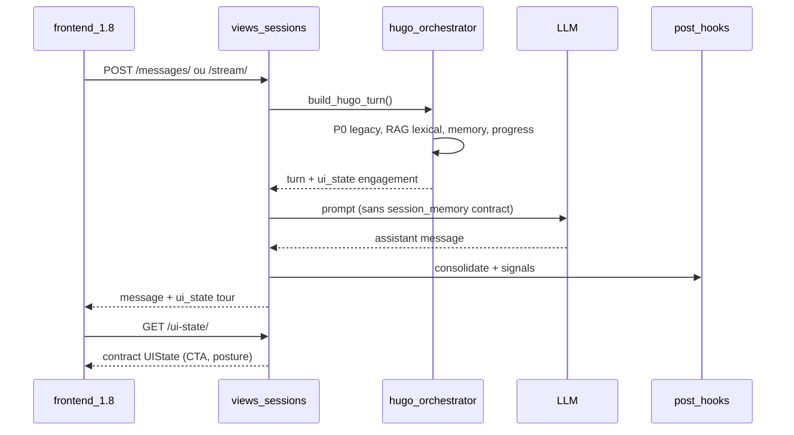

# R3 — Architecture et pipelines actualisés

**Date :** 1er juillet 2026  
**Rôle :** remplace fonctionnellement `A4_ARCHITECTURE_LOGIQUE_ET_PIPELINES.md` (22/06/2026).  
**Sources :** `hugo_orchestrator.py`, `views_sessions.py`, `ui_state_builder.py`, `rag_support.py`, `memory_consolidator.py`, clusters 11/15/16, tests cluster 3.

---

## 1. Architecture réelle actuelle

```
┌─────────────────────────────────────────────────────────────────┐
│  frontend_1.8 (Vue 3 / Vite)                                     │
│  /app* prod  │  /dashboard, /admin/* tester                      │
└───────────────────────────┬─────────────────────────────────────┘
                            │ HTTPS /api proxy (local) ou Encoors
┌───────────────────────────▼─────────────────────────────────────┐
│  hugo_back (Django 5.2 + DRF)                                    │
│  ┌─────────────┐  ┌──────────────┐  ┌──────────────────────────┐  │
│  │ accounts    │  │ referentials │  │ hugo (sessions, P0, CTA) │  │
│  │ JWT, tenant │  │ groups, RNCP │  │ library, exports, quality│  │
│  └─────────────┘  └──────────────┘  └──────────────────────────┘  │
│  app_core: TenantRLSMiddleware → SET LOCAL app.organisation_id   │
└───────────────────────────┬─────────────────────────────────────┘
                            │
         ┌──────────────────┼──────────────────┐
         ▼                  ▼                  ▼
   PostgreSQL           Redis/Celery        MinIO/S3
   (pgvector champ      (index async)       (evidence, docs)
    inactif runtime)
         │
         ▼
   Ollama / OVH AI (LLM_PROVIDER_DEFAULT + Group.llm_backend)
```

**Tag :** **REL OBSERV** — structure apps + middleware ; pgvector **inactif** en sélection RAG.

**Fichiers historiques :** A4 § architecture — **confirmé** sur le squelette ; enrichi postures/profils globaux.

---

## 2. Pipeline conversationnel réel (tour apprenant)

**Point d'entrée HTTP :** `MessageListCreate` / `MessageStreamCreate` → `build_hugo_turn()` (`hugo_orchestrator.py`).

### 2.1 Ordre des étapes (stack legacy — défaut)

| # | Étape | Module / fonction | Tag |
|---|-------|-------------------|-----|
| 1 | Contexte session | `build_hugo_context` | **REL OBSERV** |
| 2 | Posture + conduct profile | `resolve_posture`, `resolve_conduct_profile` | **REL OBSERV** |
| 3 | TurnState heuristique | `analyze_turn_state` | **REL OBSERV** |
| 4 | Classifieur P0 LLM | `classify_p0_turn_state` | **REL OBSERV** (off par défaut) |
| 5a | Décision legacy | `decide_conversation` | **REL OBSERV** (chemin actif) |
| 5b | Décision v17 | `reconcile_turn_state_v17`, `decide_conversation_v17` | **REL OBSERV** (si `HUGO_P0_V17_ENABLED=true`) |
| 6 | Plan d'enseignement | `build_teaching_plan` | **REL OBSERV** |
| 7 | Phase | `decide_next_phase` (+ classifieur phase si on) | **REL OBSERV** |
| 8 | RAG | `select_rag_chunks` (lexical) | **REL OBSERV** |
| 9 | Mémoire session | `build_session_memory` | **REL OBSERV** |
| 10 | Progression | `build_conversation_progress` + contrat | **REL OBSERV** |
| 11 | UIState tour | `build_ui_state` (engagement) | **REL OBSERV PARTIEL** |
| 12 | Prompt | `render_with_tutor_prompt` / legacy / v17 | **REL OBSERV** |
| 13 | LLM + guardrails | `views_sessions` | **REL OBSERV** |
| 14 | Hooks post-tour | `_post_conversation_hooks` | **REL OBSERV** |

### 2.2 Branche v17

- Activée uniquement si `HUGO_P0_V17_ENABLED=true` (**REL OBSERV** settings).
- Tests pytest forcent legacy (`conftest.py`) — **CART CONFIRM**.
- **À VÉRIFIER** sur Encoors.

**Changement vs A4 (22/06) :** pas de changement d'ordre ; renforcement preuves tests cluster 16 sur sorties contract.

---

## 3. Rôle actuel de P0

| Aspect | Réel | Tag |
|--------|------|-----|
| TurnState heuristique | Calculé chaque tour | **REL OBSERV** |
| Champs P0 core + LLM | Internes orchestrateur | **REL OBSERV** |
| Exposition front `/app` | **Interdite** — tests INV-01, B16-P1 | **REL OBSERV** |
| Exposition testeur | Modales debug si `VITE_P0_DEBUG_ENABLED` + mode tester | **REL OBSERV PARTIEL** |
| Classifieur P0 LLM | Off global ; override session possible | **REL OBSERV** |
| Tracing debug | `HUGO_DEBUG_TRACING` si DEBUG | **REL OBSERV PARTIEL** |

**Doctrine lot courant :** P0 = moteur interne, jamais produit apprenant (**CART CONFIRM** — aligné garde-fou convergence).

---

## 4. Statut legacy / v17

| Stack | Flag | Tests par défaut | Usage démo |
|-------|------|------------------|------------|
| Legacy | `HUGO_P0_V17_ENABLED=false` | Alignés pytest | **Recommandé local** |
| v17 | `true` | Non alignés par défaut | **HYPOTHÈSE** — démo expérimentale |

**Fichiers historiques :** A4, doc 08 — **confirmés**.

---

## 5. UIState réel

### 5.1 Deux builders (ne pas fusionner)

| Builder | Consommateur | Champs clés | Tag |
|---------|--------------|-------------|-----|
| `build_contract_ui_state` | `GET /ui-state/`, set-posture response | `scene_label`, `scene_progress`, `conversation_mode`, `learner_display_profile`, `cta_synthesis`, `cta_evaluation`, `maturity_color`, `persistent_objects` (branches), `dispersion_risk` | **REL OBSERV** |
| `build_ui_state` | Réponse tour POST/SSE | `scene_progress` (steps), `quest_cards`, `persistent_objects` (memory/trace), `supporting_documents`, `session_memory`, `gamification_profile`, `ui_visibility_flags` | **REL OBSERV** |

**ÉCART CONFIRMÉ :** schémas différents — le front prod session combine GET contract + payloads tour (**CART CONFIRM** — cluster 2 domaine 10).

### 5.2 Garde-fous confirmés

- Pas de clés P0 dans GET ui-state (**REL OBSERV** — cluster 3).
- `cta_evaluation.advisory` vs `eligible` (**REL OBSERV** — B16-C2).

**Fichiers historiques :** A3, A4 — **complétés** par cluster 4/16.

---

## 6. Mémoire

### 6.1 Dans le pipeline tour

```
build_session_memory(session, ...)
    → attaché HugoTurn.session_memory
    → inclus dans payload tour (session_memory dict)
    → build_ui_state → persistent_objects + session_memory
    → tracing JSON (debug)
```

**Non branché :** rendu prompt LLM (aucune référence `session_memory` dans services prompt) — **REL OBSERV**.

### 6.2 Endpoint dérivé

`GET .../memory-summary/` → `session_memory` (contract) + `theme_memories` (jusqu'à 10) — **REL OBSERV**.

### 6.3 Post-hook inter-session

`_post_conversation_hooks` → `consolidate_session` → `LearnerThemeMemory` — **REL OBSERV**.  
**Pas injecté** au tour suivant dans le prompt — **REL OBSERV**.

### 6.4 Front

`LearnerMemoryPanel` → memory-summary, filtre `session_memory` seul — **REL OBSERV** (C15).

**Fichiers historiques :** A4 § mémoire — **corrigé** (front consomme désormais).

---

## 7. RAG

```
should_use_rag(teaching_plan, decision, turn_state, profile)
    → select_rag_chunks(...)  # scoring lexical token overlap
    → rag_selections dans HugoTurn
    → build_ui_state.supporting_documents (top 3)
    → snippets injectés prompt (via render path)
```

- **Lexical uniquement** — **REL OBSERV** (`rag_support.py`, tests garde-fou).
- pgvector : dépendance présente, **chemin inactif** — **REL OBSERV**.
- `POST /internal/rag/search/` — debug/recherche (**REL OBSERV** local).

**Fichiers historiques :** A4 § RAG — **confirmé**.

---

## 8. CTA synthèse / évaluation

| Étape | Service | Endpoint | Tag |
|-------|---------|----------|-----|
| État boutons | `cta_ui_state.build_cta_synthesis/evaluation` | via UIState | **REL OBSERV** |
| Synthèse | `synthesis_service` | `POST .../request-synthesis/` | **REL OBSERV** |
| Readiness | — | `GET .../evaluation-readiness/` | **REL OBSERV** local |
| Évaluation | — | `POST .../request-evaluation/` | **REL OBSERV** |
| Finalisation | — | `POST .../finalize-evaluation/` | **REL OBSERV** local |
| Trace | — | `POST .../generate-trace/` + pivot v1 | **REL OBSERV** |

**Front :** boutons pilotés par CTA contract ; E2E lot 9 **SKIP** (pas session préparée) — **REL OBSERV PARTIEL**.

**Encoors 12/06 :** evaluation-readiness / finalize **absents** urlconf — **À VÉRIFIER** si déployé depuis.

---

## 9. Hooks post-tour

Ordre observé dans `views_sessions._post_conversation_hooks` :

1. `consolidate_session` (LearnerThemeMemory)
2. `record_session_signal` (observabilité base)

**Tag :** **REL OBSERV** — tests observabilité base.

D9bis (export analytique superadmin) : **chemin séparé** internal — **REL OBSERV PARTIEL**.

---

## 10. Résolution profils (ajout post-22/06)

```
Session créée
    → LearnerConversationGlobalProfile (org/groupe) si affecté
    → fallback conduct / tutor prompt legacy
    → resolve_posture + learner_display_profile (org → groupe → session)
```

**REL OBSERV** — `test_learner_conversation_global_profile.py`, admin views.

**Fichiers historiques :** absents en A4 — **nouveau** depuis matrice V6.

---

## 11. Points ambigus encore ouverts

| Point | Statut | Action |
|-------|--------|--------|
| Quel UIState fait foi pour specs ? | **CART CONFIRM** — contract pour GET ; engagement pour tour | R4 + R7 |
| v17 activé en prod ? | **À VÉRIFIER** | Oracle flags Encoors |
| Mémoire un jour dans prompt ? | **CIBLE** lot futur | Ne pas speculer comme livré |
| SSE vs POST fallback distant | **À VÉRIFIER** | Test stream auth Encoors |
| Double DB smoke vs dev | **CART CONFIRM** | Toujours tracer stack avant test |

---

## 12. Diagramme séquence simplifié (tour)



---

*Suite : **R4** (contrats détaillés et qualité de preuve).*
