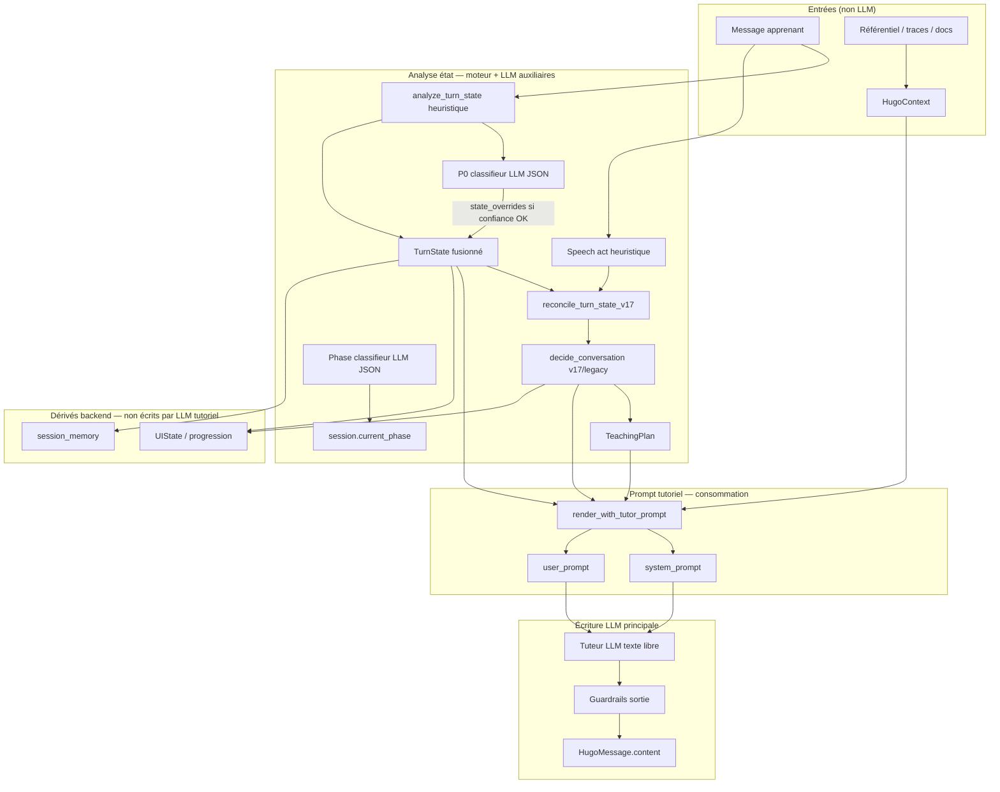
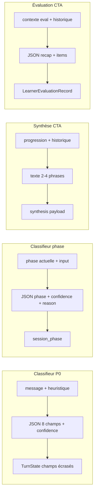
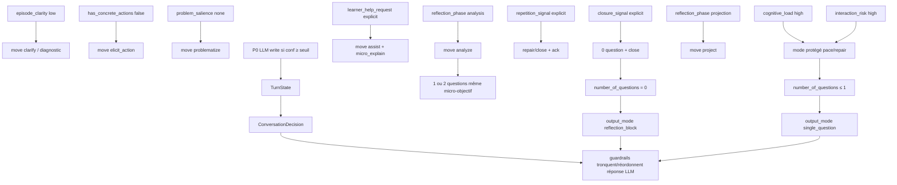

# Variables prompting Hugo — consommables, écriture LLM, relations

**Date :** 2026-06-18  
**Sources :** `prompt_renderer.py`, `hugo_orchestrator.py`, `p0_classifier.py`, `phase_decider.py`, `decision_engine*.py`, `views_sessions.py`, `output_guardrails_v17.py`, `synthesis_service.py`, `evaluation_service.py`, `domain/schemas.py`.

**Réel confirmé :** deux familles distinctes — **variables consommables** (injectées dans `TutorPrompt` via `str.format`) et **variables écriture LLM** (produites par un appel modèle puis parsées / post-traitées par le backend). Les **décisions et états intermédiaires** (`TurnState`, `ConversationDecision`) sont calculés **côté moteur** (heuristiques + règles), sauf les 8+3 champs explicitement demandés en JSON aux classifieurs.

**Annexe détaillée consommable :** [`inventaire_variables_templates_prompt_hugo.md`](inventaire_variables_templates_prompt_hugo.md) (même contenu structuré Partie II ci-dessous, enrichi).

---

# Partie I — Architecture et schéma logique

## I.1 Vue d’ensemble du cycle d’un tour



## I.2 Pipelines LLM auxiliaires (hors tour tutoriel)



## I.3 Graphe des dépendances causales (simplifié)



---

# Partie II — Variables consommables (lecture / injection template)

> **Syntaxe :** `TutorPrompt.system_template` / `user_template` → Python `str.format(**vars_dict)`.  
> **Producteur :** `_base_vars()` + `render_with_tutor_prompt()` dans `prompt_renderer.py`.

## II.A Identité et fil

| Variable | Type | Signification | Calcul | Usage Hugo | Usage prompting |
|----------|------|---------------|--------|------------|-----------------|
| `organisation_id` | str | Tenant | `session.organisation_id` | RLS, traces | Debug interne |
| `session_id` | str | Session | `session.id` | Mémoire, UI | Éviter face apprenant |
| `situation_content` | str | Verbatim tour courant balisé | `<<<APPRENANT\n{content}\nAPPRENANT>>>` | User prompt | **Ancrage factuel** |
| `history_block` | str | Tours précédents | Max 48 msg / 14k car. | Continuité | Mémoire implicite du fil |

**Lacune :** `session_memory` **non** injectée dans `vars_dict` (CIBLE lot mémoire prompt).

## II.B Référentiel, focus, plan

| Variable | Type | Signification | Calcul | Usage prompting |
|----------|------|---------------|--------|-----------------|
| `referential_block` | str | Référentiel + items ± focus fusionné | `HugoContext` max 3 items | Compétences / critères |
| `focus_guidance_block` | str | Focus du tour | `TeachingPlan` + match item | Anti-boucle, critère actif |
| `focus_competence` | dict | Focus structuré | `build_teaching_plan()` | `{focus_competence[label]}` |
| `regulation_targets` | dict | Poids task/reasoning/metacognition | Profil + move | Axe réflexif dominant |
| `session_phase` | str | Phase séance | TurnState + phase_decider | Profondeur attendue |
| `max_questions_this_turn` | int | Plafond questions effectif | min(posture, décision) | **Contrainte dure** |
| `ui_focus_label` | str | Libellé focus discours | `_derive_ui_focus_label()` | Accroche pédagogique |
| `learner_block` | str | Synthèse + traces | LearnerState + Trace | Personnalisation |
| `documents_block` | str | Titres docs ± RAG | GroupDocument + chunks | Appui documentaire |
| `rag_chunks_block` | str | Extraits RAG formatés | `select_rag_chunks()` | Citations situées |

## II.C Posture et macros

| Variable | Contenu |
|----------|---------|
| `conversation_profile` | `diagnostic` \| `reflective_afest` \| `knowledge_review` |
| `posture_block` | Contraintes `TutorConductProfile` |
| `thread_guidance_block` | Directives anti-boucle, clôture, 0–2 questions |
| `base_system_intro` | Intro + état + décision + posture + fil |
| `turn_state` / `turn_state_block` | P0 complet / sous-ensemble lisible |
| `conversation_decision` / `decision_block` / `response_constraints_block` | Décision tutorale |
| `competence_brief` | Fiche compétence (optionnel) |
| `teaching_plan` | Objet complet (repr peu lisible) |

**Nested (profil de conduite uniquement) :** `{posture}`, `{max_questions}`, `{forbidden_moves}`, `{description}` — **pas** clés top-level TutorPrompt.

**v1.7 append :** bloc `_v17_guidance_block` concaténé (non variable template).

→ Détail exhaustif champs P0, TeachingPlan, CompetenceBrief : **annexe** [`inventaire_variables_templates_prompt_hugo.md`](inventaire_variables_templates_prompt_hugo.md) §9–11.

---

# Partie III — Variables écriture LLM

Variables **produites par un modèle** et **consommées par le backend** (parse, validation, fusion, persistance). Distinction :

| Symbole | Signification |
|---------|---------------|
| **Parse** | Extraction JSON / structure depuis texte brut |
| **Persist** | Écriture durable (DB, état session) |
| **Surface** | Visible apprenant |
| **Interne** | Moteur / traces / jamais UI apprenant |

---

## III.1 Réponse tutorielle principale (tour apprenant)

**Pipeline :** `complete_with_provider()` → `_apply_reply_guardrails()` → `HugoMessage.content`.

### III.1.1 Variable surface

| Variable | Type | Signification | Format attendu LLM | Post-traitement | Persist |
|----------|------|---------------|-------------------|-----------------|---------|
| `assistant_reply` | `str` | Réponse Hugo au tour | Texte français libre, guidé par `output_format_mode` et contraintes | Guardrails v17 ou legacy ; anti meta-leak | `HugoMessage.content` (**Surface**) |

### III.1.2 Structure implicite écrite (non JSON)

Le LLM écrit du **texte libre**, mais le backend en extrait une **structure implicite** :

| Composant | Détection | Contraintes entrantes | Règle post-écriture |
|-----------|-----------|----------------------|---------------------|
| `prefix_text` | Texte hors `?` | `should_explain_briefly`, `response_mode=assist` | Conservé, tronqué ~260 car. (v17) |
| `questions[]` | Regex `[^?!\n]*\?+` | `max_questions_this_turn`, `target_question_count`, `question_style` | Max 0–2 (v17) ou 1–3 (legacy) ; numérotation `1.` |
| `blocked_questions[]` | — | `blocked_question_topics` ⊆ `covered_points` | Questions filtrées si topic déjà couvert |
| `list_items[]` | Lignes `-` / `1.` | `allow_lists` TutorPrompt, modes recap/closure | Strippées en v17 si mode recap/eval/closure |

### III.1.3 Modes de sortie (`output_mode` — dérivé, pas écrit par LLM)

| `output_mode` | Déclencheurs | Attente rédactionnelle LLM | Guardrail |
|---------------|--------------|---------------------------|-----------|
| `single_question` | Config TutorPrompt ou `single_question_only` | 1 question courte | Extrait 1ère question |
| `multi_question_numbered` | Config + phase exploration | 1–3 questions numérotées | Troncature + renumérotation |
| `reflection_block` | Phase deepening/closure, ou `number_of_questions=0` | Constats + 0–2 questions ou texte continu | Supprime questions si closure/recap |

**Paramètres TutorPrompt influençant l’écriture :** `output_format_mode`, `max_questions_per_turn`, `max_tokens`, `allow_lists`, `tone`, `language`.

### III.1.4 Échecs et replis

| Condition | Comportement |
|-----------|--------------|
| Réponse vide | Fallback `_safe_assistant_fallback()` selon `closure_signal`, `learner_help_request`, `repetition_signal` |
| Meta-leak (system prompt, P0…) | Remplacement par fallback sécurisé |
| Trop de questions | Troncature guardrails |
| Questions sur topics bloqués | Suppression individuelle |

---

## III.2 Classifieur P0 (LLM auxiliaire — écriture structurée)

**Pipeline :** `classify_p0_turn_state()` → parse JSON → fusion `analyze_turn_state(state_overrides=…)`.

| Variable | Type | Valeurs | Signification | Validation | Persist si OK |
|----------|------|---------|---------------|------------|---------------|
| `confidence` | float | 0.0–1.0 | Confiance classifieur | ≥ `p0_classifier_min_confidence` | Méta trace |
| `episode_clarity` | enum | low, medium, high | Clarté scène | `P0_ALLOWED_VALUES` | **TurnState** |
| `has_concrete_actions` | bool | true/false | Actions concrètes | idem | **TurnState** |
| `problem_salience` | enum | none, low, high | Problème identifié | idem | **TurnState** |
| `reflection_phase` | enum | description, analysis, projection | Phase réflexive | idem | **TurnState** |
| `affect_valence` | enum | negative, neutral, positive | Ton affectif | idem | **TurnState** |
| `cognitive_load` | enum | low, medium, high | Charge cognitive | idem | **TurnState** |
| `interaction_risk` | enum | low, medium, high | Risque relationnel | idem | **TurnState** |

**Calcul fusion :** seuls ces 8 champs peuvent **écraser** l’heuristique ; le reste de `TurnState` reste heuristique. Si parse / confiance / payload invalide → **aucune écriture LLM** (fallback heuristique, `source_by_field=heuristic`).

**Usage pédagogique :** le classifieur **affine la lecture** du message ; il ne parle **pas** à l’apprenant.

**Usage technique :** champs = entrées de `decide_conversation()` ; traçés dans `p0_classifier` du `llm_request_payload`.

---

## III.3 Classifieur de phase (LLM auxiliaire)

**Pipeline :** `decide_next_phase()` → JSON → validation transition.

| Variable | Type | Valeurs | Signification | Persist |
|----------|------|---------|---------------|---------|
| `phase` | enum | opening, exploration, deepening, potential_closure | Phase proposée | `session.current_phase` si transition autorisée + confiance OK |
| `confidence` | float | 0.0–1.0 | Confiance | Trace phase_decision |
| `reason` | str | ≤140 car. | Justification courte | Trace interne |

**Garde-fous :** transition doit être dans le graphe autorisé `_is_transition_allowed()` ; sinon phase adaptateur déterministe conservée.

---

## III.4 Synthèse scène (CTA synthèse)

**Pipeline :** `generate_synthesis()` → texte libre → payload dict.

| Variable | Type | Signification | Format LLM | Persist / Surface |
|----------|------|---------------|------------|-------------------|
| `synthesis_text` | str | Mini-bilan métier | 2–4 phrases, pas de JSON | Retour API CTA ; **Surface** apprenant |
| `title` | str | Titre fixe backend | — | `"Synthèse de la scène"` (non LLM) |
| `source` | str | Origine | — | `llm` ou `fallback` |

**Entrées influençant l’écriture :** posture, maturité, fils actifs, excerpt learner, points ouverts, historique 6 messages.

---

## III.5 Évaluation réflexive (CTA évaluation)

**Pipeline :** `generate_evaluation_payload()` → JSON → `_normalize_evaluation_output()`.

### III.5.1 Racine

| Variable | Type | Valeurs | Signification | Surface |
|----------|------|---------|---------------|---------|
| `overall_status` | enum | partial, complete, early_trigger | Maturité globale éval | Oui (prudence si early) |
| `recap_text` | str | Texte | Bilan lisible apprenant | **Oui** |
| `first_message` | str | Texte | Premier message éval ( défaut = recap) | **Oui** |
| `items` | list[object] | Voir §III.5.2 | Positionnement par critère | Oui (structuré) |

### III.5.2 Item d’évaluation

| Variable | Type | Valeurs | Signification |
|----------|------|---------|---------------|
| `target_item_id` | str | ID référentiel | Critère ciblé |
| `label` | str | Libellé | Nom critère |
| `positioning_level` | enum | not_covered, partial, demonstrated, mastered | Niveau observé |
| `evidence_basis` | str | Texte | Indice conversationnel invoqué |
| `confidence` | float | 0.0–1.0 | Confiance jugement |
| `missing_evidence` | list[str] | Preuves manquantes | Si partial / not_covered |
| `learner_self_position` | str | Auto-positionnement | Optionnel |
| `status` | str | draft… | Workflow (défaut draft) |

**Garde-fous :** normalisation force enums ; fallback déterministe si JSON absent ; profil `early_trigger` si maturité ≠ green.

**Usage pédagogique :** évaluation **prudente**, jamais certificative autonome — validation humaine requise (`human_validation_required`).

---

## III.6 Variables **non** écrites par LLM (confusion fréquente)

| Objet | Producteur | Pourquoi pas LLM |
|-------|------------|------------------|
| `ConversationDecision` | `decide_conversation*` | Règles déterministes sur TurnState |
| `TeachingPlan` | `build_teaching_plan*` | Agrégation référentiel + profil |
| `session_memory` | `build_session_memory()` | Résumé gouverné backend |
| `UIState` / `conversation_progress` | `build_ui_state`, `build_conversation_progress` | Contrat produit |
| `learner_speech_act` | `classify_learner_speech_act()` | **Heuristique regex**, pas LLM |
| `rag_selections` | `select_rag_chunks()` | Retrieval lexical |

---

# Partie IV — Relations, implications et dépendances

## IV.1 Typologie des relations

| Type | Exemple | Langage |
|------|---------|---------|
| **Implication forte** | `closure_signal=explicit` → `number_of_questions=0` | Technique (moteur) |
| **Implication pédagogique** | `episode_clarity=low` → questions de clarification scène | Pédagogique |
| **Conditionnelle** | P0 LLM n’écrit que si `confidence ≥ seuil` | Technique |
| **Post-contrainte** | Décision fixe N questions → guardrails tronquent réponse LLM | Technique |
| **Bloquant** | `blocked_question_topics` ⊆ questions interdites | Pédagogique + technique |

---

## IV.2 Chaîne entrée → état → décision → écriture tutorielle

### Étape 1 — Lecture du message apprenant

**Pédagogique :** Hugo commence par comprendre *où en est* l’apprenant dans sa réflexion : a-t-il décrit une situation concrète ? Identifie-t-il un problème ? Est-il en analyse ou en projection ?

**Technique :**

1. `analyze_turn_state()` produit un `TurnState` heuristique complet.
2. Si classifieur activé, le LLM P0 peut **réécrire 8 champs** ; fusion via `state_overrides`.
3. v1.7 : `classify_learner_speech_act()` (regex) + `reconcile_turn_state_v17()` enrichit signaux dérivés (`coverage_status`, éligibilités recap/eval).

**Implications clés :**

| Si (TurnState) | Alors (tendance décision) | Effet sur écriture LLM tutoriel |
|----------------|---------------------------|--------------------------------|
| `episode_clarity = low` | `clarify` | Questions sur la scène, pas sur critères |
| `has_concrete_actions = false` | `elicit_action` | Demander action/fait observable |
| `problem_salience = none` (+ conditions) | `problematize` | Aider à formuler l’enjeu |
| `reflection_phase = analysis` | `analyze` | Questions causales / critères |
| `reflection_phase = projection` | `project` | Transfer / règle d’action future |
| `learner_help_request = explicit` | `assist` + micro-explain | Texte d’aide **avant** question |
| `closure_signal = explicit` | `close`, 0 question | Texte de clôture sans relance |
| `repetition_signal = explicit` | `repair` ou `close` | Reconnaissance + changement de move |
| `cognitive_load = high` OU `interaction_risk = high` | mode protégé | 1 question simple, pas d’empilement |
| `safety_or_quality_risk_level ≥ medium` | `analyze` + ancrage référentiel | Questions sur critère / preuve |

### Étape 2 — Décision tutorale (non LLM)

**Pédagogique :** le moteur choisit **une** intention régulatrice pour ce tour (clarifier, approfondir, aider, clore…) et **combien** de questions sont encore utiles.

**Technique :** `decide_conversation()` / `decide_conversation_v17()` — arbre de priorités :

1. Mode protégé (charge / risque)
2. Clôture explicite
3. Répétition explicite
4. Demande d’aide explicite
5. Risque sécurité/qualité
6. … jusqu’au mode stabilisation / reformulation

**Implications sur variables consommables :**

- `number_of_questions` → `max_questions_this_turn` (borné par posture TutorPrompt)
- `response_constraints` → injectées dans `response_constraints_block`
- v1.7 : `response_mode` → `_v17_guidance_block` + guardrails (recap/assist/closure)

### Étape 3 — Rendu prompt (consommation)

**Pédagogique :** le template reçoit le **contexte métier** (référentiel, focus, historique) et les **consignes de conduite** (posture, max questions, points déjà couverts).

**Technique :** corrélation directe décision → template :

| Décision | Variables consommables renforcées |
|----------|-----------------------------------|
| `assist` | `thread_guidance_block`, `should_explain_briefly` via decision_block |
| `close` | `max_questions_this_turn=0`, thread_guidance clôture |
| focus critère | `focus_guidance_block`, `ui_focus_label` |
| RAG actif | `rag_chunks_block` → fusion `documents_block` |

### Étape 4 — Écriture et post-traitement réponse

**Pédagogique :** même si le modèle « en fait trop », les guardrails garantissent qu’Hugo ne noie pas l’apprenant sous les questions, ne rouvre pas un point clos, et ne fuit pas ses instructions internes.

**Technique :**

```
raw LLM text
  → apply_output_guardrails_v17 (ou legacy)
    → filtre questions bloquées
    → tronque à target_question_count
    → strip listes si recap/closure
  → _apply_meta_response_guardrail
    → remplace si fuite meta
  → HugoMessage.content
```

**Dépendance critique :** l’écriture LLM tutorielle est **subordonnée** à la décision — le modèle propose, le backend **dispose**.

---

## IV.3 Relations inter-pipelines

| Producteur | Consommateur | Relation |
|------------|--------------|----------|
| P0 LLM write (8 champs) | `decide_conversation` | Affinement état → change move/questions |
| Phase LLM write | `session_phase` | Change profondeur attendue tours suivants |
| TurnState + Decision | Variables template | Alimentent consommables |
| TurnState + Decision | `output_mode` | Contrainte forme réponse |
| `assistant_reply` (tour N) | `last_tutorial_move` (tour N+1) | Boucle : move précédent influence anti-boucle |
| `covered_points` | `blocked_question_topics` | Points couverts → questions interdites v1.7 |
| Synthèse LLM | CTA partage | Indépendant du tour ; lit progression |
| Éval LLM | Traces / pivot | Indépendant ; JSON normalisé |

---

## IV.4 Matrice consommation ↔ écriture

| Couche | Consommable (template) | Écriture LLM | Producteur backend |
|--------|------------------------|--------------|-------------------|
| Message apprenant | `situation_content` | — | Apprenant |
| Historique | `history_block` | — | DB messages |
| État P0 | `turn_state_block` | 8 champs classifieur P0 | Heuristique + LLM optionnel |
| Décision | `decision_block` | — | decision_engine* |
| Plan | `focus_guidance_block`, `session_phase` | — | teaching_plan_builder |
| Réponse Hugo | — | `assistant_reply` | LLM + guardrails |
| Phase séance | `session_phase` (lecture) | `phase` classifieur | phase_decider |
| Synthèse | — | `synthesis_text` | synthesis_service |
| Évaluation | — | JSON eval | evaluation_service |

---

## IV.5 Explications pédagogiques par famille

### Famille « clarté scène » (`episode_clarity`, `has_concrete_actions`)

Tant que l’apprenant n’a pas ancré une situation observable, Hugo **ne doit pas** enchaîner sur l’analyse de compétences. C’est la règle AFEST de base : d’abord le réel vécu, ensuite la réflexion.

### Famille « risque relationnel » (`interaction_risk`, `cognitive_load`)

Si l’apprenant est saturé ou tendu, Hugo **ralentit** : une seule question simple, pas de double relance, pas de micro-cours. Priorité : continuer la relation d’apprentissage.

### Famille « régulation du fil » (`covered_points`, `repetition_signal`, `closure_signal`)

Hugo suit un fil réflexif (décrire → problématiser → analyser → projeter). Les points déjà validés ne doivent pas être **re-questionnés** sauf contradiction. Si l’apprenant dit « on tourne en rond » ou « j’ai fini », le moteur **change de move** avant que le LLM ne rédige.

### Famille « posture » (`conversation_profile`)

- **Diagnostic** : isoler le blocage, peu de fronts ouverts.
- **Réflexif AFEST** : accompagner sans sur-questionner.
- **Knowledge review** : stabiliser un repère/méthode sans magistral.

La posture influence **à la fois** les consommables (intro, regulation_targets) et les moves interdits (`forbidden_moves`).

### Famille « évaluation / synthèse »

Ce ne sont **pas** des tours conversationnels ordinaires : le LLM produit un **artefact** (bilan ou JSON critères) consommé par des CTA et des workflows de validation humaine.

---

## IV.6 Explications techniques — ordre de priorité décision (legacy)

Extrait logique `decide_conversation()` — **premier match gagne** :

1. `protected_mode` (charge/risque high)
2. `explicit_closure_case`
3. `explicit_repetition_case`
4. `explicit_help_request_case`
5. `safety_or_quality_risk_level` medium/high
6. `contradiction_status=suspected`
7. `closeable_case`
8. `clarify_frontier_reached` (anti-boucle clarify)
9. `analysis_case`
10. `projection_case`
11. `episode_clarity=low`
12. `not has_concrete_actions`
13. `problem_salience=none` → problematize
14. `intervention_necessity=none` → reformulate stabilisation
15. défaut → reformulate description

Puis ajustements : encouragement, double question (conditions strictes), micro-explication.

---

# Partie V — Références et écarts

| Document | Rôle |
|----------|------|
| [`inventaire_variables_templates_prompt_hugo.md`](inventaire_variables_templates_prompt_hugo.md) | Inventaire consommable exhaustif (Partie II étendue) |
| `hugo-main/docs/TUTOR_PROMPT_PLACEHOLDERS.md` | Référence historique (incomplète vs réel) |
| `hugo_back/docs/p0_description_technique_actuelle.md` | P0 moteur |

| Écart | Statut |
|-------|--------|
| Mémoire gouvernée non consommable ni écrite LLM tutoriel | PARTIEL |
| `response_mode` v1.7 non placeholder template | PARTIEL |
| Speech act heuristique vs LLM | Réel (by design) |
| P0 complet non écrit par LLM (8/40+ champs) | Réel (by design) |

---

*Document unifié — consommables + écriture + relations. Ancré code `hugo_back` juin 2026.*
